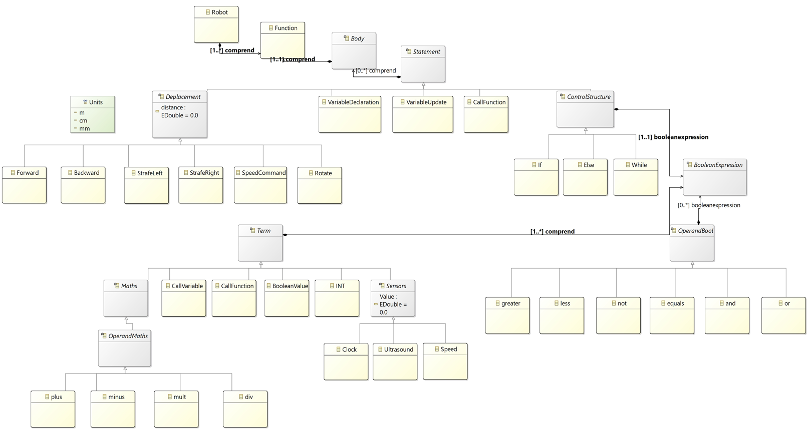
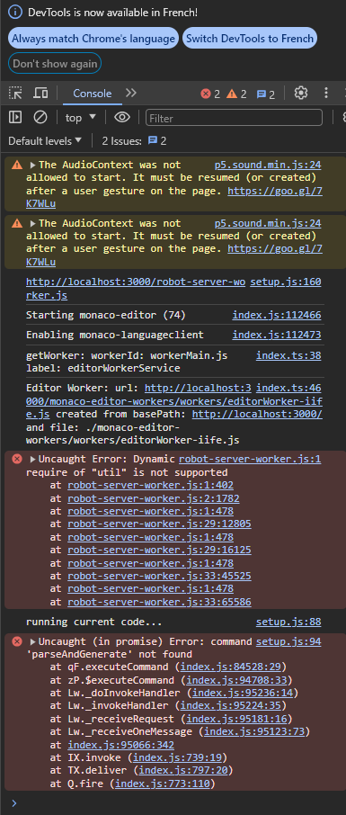
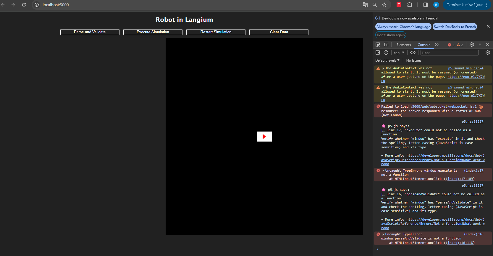
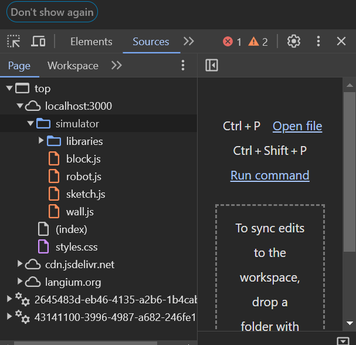
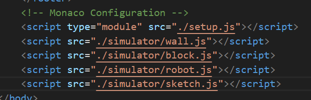
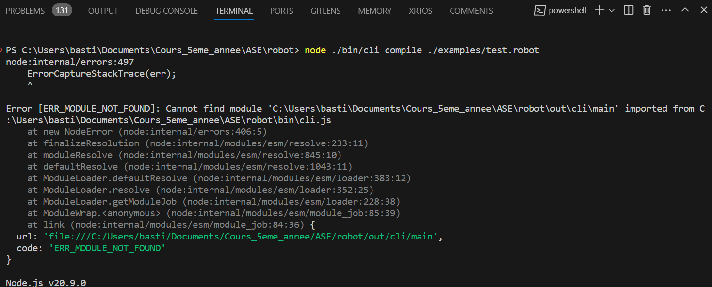

# Robot project - ASE

Developed by Quentin Legrand & Bastien Sauvat

## 💻 Presentation

For this project we developed ASE_Robot, a language to define the behavior of a small robot.
This DSL include modeling domain and the associated tooling , an interpretor and a compiler. 

## 🔨 Architecture

Here is the model we created and relied on for our DSL.


## 📝 Running

To use the DSL, you need to :
- install these precise versions of Langium and Yo
```bash
npm install -g yo@4.3.1 generator-langium@2.0.0
```
- clone this repository
```bash 
git clone https://github.com/bsauvat/New_ASE_Robot.git
```
- place yourself in the robot directory
```bash 
cd robot
```
- build the project
```bash 
npm run build:web
```
- run the server
```bash 
npm run serve
```
- open port 3000 : 
http://localhost:3000/

## 💻 Interpreter (major part)

We tried 2 possibilities to develop our interpreter :
- **classic method following langium web tutorial (in Master branch)**
- **web sockets method (in Websockets branch)**

We encountered **errors for both solutions** that we did not arrive to resolve that are the following ones :

### For the **classic method following langium web tutorial** :



The error message **"Dynamic require of "util" is not supported"** appears in the web console after lunching the command : npm run serve.
Unfortunately, we never managed to resolve this bug even when trying to change dependencies and versions.

When clicking on **Execute simulation** on the web page, we get the error **"Uncaught (in promise) Error: command 'parseAndGenerate' not found**

We develop all the methods concerning this case including : the HTML part and the functions in the setup.js file yet.

Because of this problem, the simulation never started.


### For the **web sockets method** :

We also try this method because we didn't arrive to solve the first problem.



But with the websockets, the code on the left side doesn't appear unlike the first method.

We get different errors :
- **Failed to load : resource**
- **Uncaught TypeError : window.execute is not a function**

In fact, the setup.js isn't recognized in the websources files :



Whereas we include this file in the Monaco configuration like all the other files as you can see just above.

## 💻 Compiler (minor part)

Place yourself in robot folder, compiler can be tested with the command :
```bash
node ./bin/cli compile ./examples/test.robot
```

Compiler is located in **Compiler branch** in **src>language>semantic>compiler** folder

The librairies have been imported and the RobotVisitor implementation has been developed in compiler.ts file.

Unfortunetaly, we face an error that we did not manage to resolve which is :



We checked our files, and all the links are functional between the functions, the imports, and the files, but we did not solve this error.


